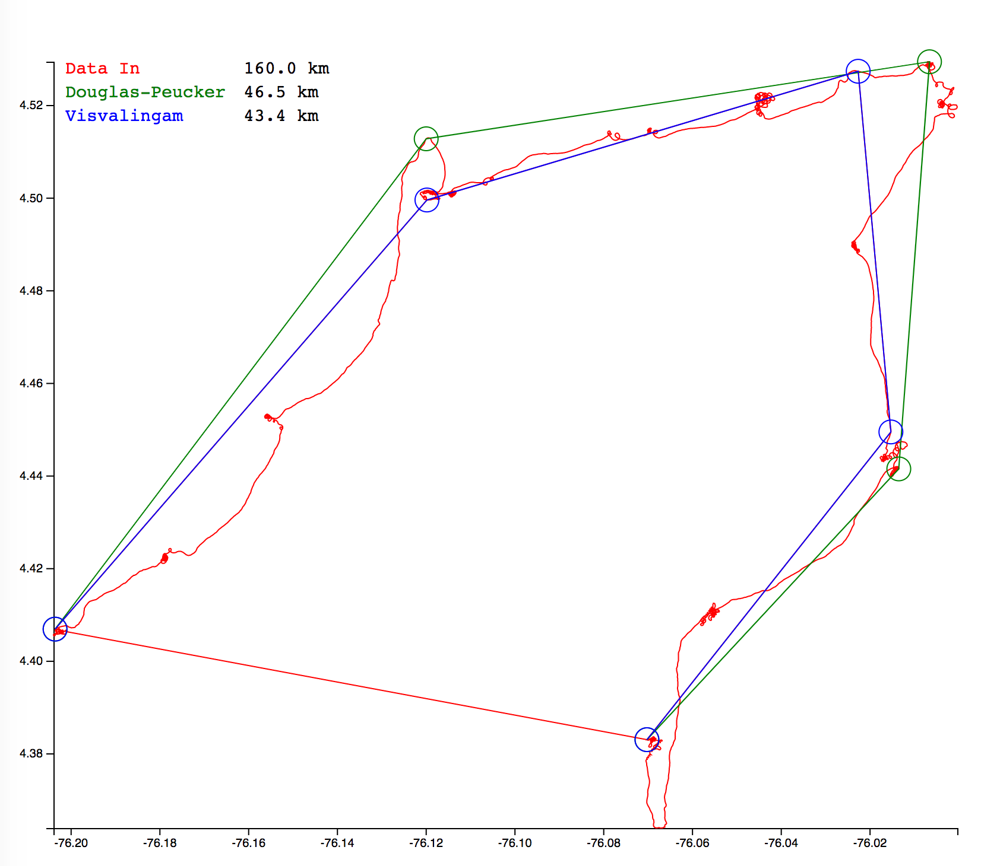

# line-simplify

Go implementation of line simplification algorithms, with results plotted using D3.

This work is specifically for simplification of GPS track plots, in the example case for FAI/IGC Flight Recorder Data Format files (e.g. for paragliding, sailplane flying etc).

## Example Plot

## Algorithms

* Douglas-Peucker
* Visvalingam

### Douglas-Peucker

The purpose of the algorithm is, given a curve composed of line segments (which is also called a Polyline in some contexts), to find a similar curve with fewer points. The algorithm defines 'dissimilar' based on the maximum distance between the original curve and the simplified curve (i.e., the Hausdorff distance between the curves). The simplified curve consists of a subset of the points that defined the original curve.

More [Douglas-Peucker](https://en.wikipedia.org/wiki/Ramer%E2%80%93Douglas%E2%80%93Peucker_algorithm) info

### Visvalingam

This algorithm performs a line simplification that produces less angular results than the filtering algorithm of Douglas and Peucker. The algorithm was proposed by Visvalingam & Whyatt 1993.

The principle of the algorithm is to select the vertices to delete (the less characteristic ones) rather than choosing the vertices to keep (in the Douglas and Peucker algorithm). To select the vertices to delete, there is an iterative process, and at each iteration, the triangles formed by three consecutive vertices are computed. If the area of the smallest triangle is smaller than a threshold (“area_tolerance” parameter), the middle vertex is deleted, and another iteration starts.

More [Visvalingam](https://ignf.github.io/CartAGen/docs/algorithms/line/visvalingam.html) info